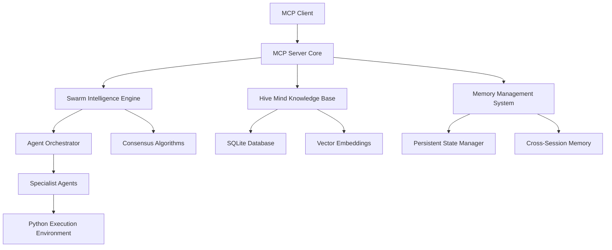

# MCP Swarm Intelligence Server - Software Stacks & Architecture Plan

> **Last Updated**: September 17, 2025  
> **Purpose**: Technical architecture and software stack planning for the Enhanced MCP Swarm Intelligence Server

## Executive Summary

This document outlines the comprehensive software architecture, technology stacks, and implementation strategies for building the Enhanced MCP Swarm Intelligence Server. The project integrates Model Context Protocol (MCP) capabilities with advanced swarm intelligence algorithms and persistent memory systems.

## Overall System Architecture



## Core Technology Stack

### 1. Primary Language & Runtime
- **Python 3.11+**: Primary development language
  - **Rationale**: Excellent async/await support, rich ML ecosystem, MCP SDK availability
  - **Dependencies**: asyncio, typing, dataclasses, enum
  - **Performance**: Sufficient for coordination tasks, can delegate compute-heavy work

### 2. MCP Protocol Implementation
- **MCP Python SDK**: Official Model Context Protocol implementation
  - **Version**: Latest stable (1.x)
  - **Components**: Server, Client, Transport, Protocol definitions
  - **Message Handling**: JSON-RPC 2.0 over stdio/HTTP
  - **Tool Registration**: Dynamic tool discovery and registration

### 3. Database & Persistence Layer
```python
# Primary Stack
SQLite 3.40+ (Embedded database)
├── Core Tables: agents, tasks, knowledge, consensus, memory
├── Indexes: B-tree for queries, FTS5 for full-text search
├── Extensions: JSON1 for document storage, FTS5 for search
└── Backup: WAL mode with periodic snapshots

# Alternative/Future: PostgreSQL for production scaling
```

### 4. Machine Learning & AI Components
```python
# Vector Embeddings & Semantic Search
sentence-transformers==2.2.2
├── Models: all-MiniLM-L6-v2 (lightweight, fast)
├── Vector Storage: SQLite with vector similarity
└── Similarity: Cosine similarity for knowledge matching

# Pattern Recognition
scikit-learn==1.3.0
├── Algorithms: Decision trees, clustering, classification
├── Optimization: Genetic algorithms for swarm parameters
└── Prediction: Success probability models

# Optional: Advanced ML (if needed)
transformers==4.30.0  # For advanced NLP tasks
torch==2.0.0         # If deep learning is required
```

### 5. Async & Concurrency Framework
```python
# Core Async Stack
asyncio (built-in)           # Event loop and coroutines
aiofiles==23.1.0            # Async file operations
aiohttp==3.8.4              # HTTP client/server (if needed)
asyncio-mqtt==0.11.0        # Message passing (alternative to direct calls)

# Coordination & Synchronization
asyncio.Queue               # Task queues
asyncio.Lock                # Resource protection
asyncio.Event               # Coordination signals
concurrent.futures          # Thread pool for CPU-bound tasks
```

## Component-Specific Technology Stacks

### 1. MCP Server Core Stack

```yaml
Framework: Python asyncio + MCP SDK
Dependencies:
  - mcp: "^1.0.0"                    # Official MCP Python SDK
  - pydantic: "^2.0.0"               # Data validation and serialization
  - typing-extensions: "^4.7.0"      # Enhanced type hints
  - jsonschema: "^4.18.0"            # JSON schema validation

Architecture:
  - Server: Async MCP server with tool registration
  - Tools: Dynamic tool discovery and execution
  - Resources: File and data resource management
  - Messages: Request/response handling with error propagation
```

### 2. Swarm Intelligence Engine Stack

```yaml
Algorithms: Ant Colony Optimization (ACO) + Particle Swarm Optimization (PSO)
Dependencies:
  - numpy: "^1.24.0"                 # Numerical computations
  - scipy: "^1.11.0"                 # Scientific algorithms
  - networkx: "^3.1.0"               # Graph algorithms for coordination
  - deap: "^1.3.3"                   # Evolutionary algorithms

Core Components:
  - Pheromone Trails: Numpy arrays with decay functions
  - Fitness Functions: Multi-objective optimization
  - Consensus Building: Weighted voting with confidence scores
  - Task Assignment: ACO-based optimal agent selection
```

### 3. Hive Mind Knowledge Base Stack

```yaml
Database: SQLite with FTS5 and JSON1 extensions
Dependencies:
  - sqlite3: (built-in)              # Core database operations
  - sentence-transformers: "^2.2.2"  # Semantic embeddings
  - whoosh: "^2.7.4"                 # Full-text search indexing
  - networkx: "^3.1.0"               # Knowledge graph relationships

Schema Design:
  - knowledge_entries: Core knowledge with metadata
  - embeddings: Vector representations for similarity
  - relationships: Graph connections between knowledge
  - confidence_scores: Quality and reliability metrics
```

### 4. Memory Management System Stack

```yaml
Persistence: SQLite with WAL mode for concurrent access
Dependencies:
  - sqlite3: (built-in)              # Database operations
  - pickle: (built-in)               # Object serialization
  - json: (built-in)                 # Structured data serialization
  - threading: (built-in)            # Thread-safe operations

Memory Types:
  - Working Memory: In-memory dictionaries and queues
  - Short-term Memory: Session-based SQLite tables
  - Long-term Memory: Persistent SQLite with indexing
  - Shared Memory: Cross-agent knowledge sharing
```

### 5. Agent Orchestrator Stack

```yaml
Coordination: Async task queues with priority scheduling
Dependencies:
  - asyncio: (built-in)              # Core async framework
  - typing: (built-in)               # Type definitions
  - dataclasses: (built-in)          # Agent configuration
  - enum: (built-in)                 # State definitions

Agent Management:
  - Discovery: File system scanning for agent configs
  - Registration: Dynamic agent capability registration
  - Load Balancing: Round-robin with capability matching
  - Health Monitoring: Heartbeat and performance tracking
```

## Development Environment Stack

### 1. Python Environment
```yaml
Python: 3.11+
Package Manager: pip + virtualenv (or conda)
Virtual Environment: venv or conda environment

Dependencies Management:
  - requirements.txt: Production dependencies
  - requirements-dev.txt: Development dependencies
  - pyproject.toml: Project metadata and build config
```

### 2. Code Quality & Testing
```yaml
Testing Framework:
  - pytest: "^7.4.0"                # Primary testing framework
  - pytest-asyncio: "^0.21.0"       # Async test support
  - pytest-cov: "^4.1.0"            # Coverage reporting
  - hypothesis: "^6.82.0"           # Property-based testing

Code Quality:
  - black: "^23.7.0"                # Code formatting
  - flake8: "^6.0.0"                # Linting
  - mypy: "^1.5.0"                  # Type checking
  - isort: "^5.12.0"                # Import sorting

Security:
  - bandit: "^1.7.5"                # Security linting
  - safety: "^2.3.0"                # Dependency vulnerability scanning
```

### 3. Documentation & Development Tools
```yaml
Documentation:
  - mkdocs: "^1.5.0"                # Documentation generation
  - mkdocs-material: "^9.1.0"       # Material design theme
  - docstring-parser: "^0.15"       # API documentation extraction

Development Tools:
  - pre-commit: "^3.3.0"            # Git hooks for quality checks
  - commitizen: "^3.6.0"            # Conventional commits
  - bumpversion: "^0.6.0"           # Version management
```

## Deployment & Infrastructure Stack

### 1. Containerization (Optional)
```yaml
Container Runtime: Docker
Base Image: python:3.11-slim
Multi-stage Build: 
  - Build stage: Install dependencies and compile
  - Runtime stage: Minimal image with application

Orchestration:
  - docker-compose: Development environment
  - Kubernetes: Production deployment (if scaling needed)
```

### 2. CI/CD Pipeline
```yaml
Platform: GitHub Actions
Workflows:
  - test.yml: Run tests on multiple Python versions
  - quality.yml: Code quality checks and security scanning
  - build.yml: Build and package application
  - deploy.yml: Deployment automation

Environments:
  - Development: Feature branch testing
  - Staging: Integration testing environment
  - Production: Release deployment
```

### 3. Monitoring & Observability
```yaml
Logging:
  - structlog: "^23.1.0"            # Structured logging
  - loguru: "^0.7.0"                # Enhanced logging capabilities

Metrics:
  - prometheus-client: "^0.17.0"    # Metrics collection
  - Custom metrics: Agent performance, task success rates

Health Checks:
  - HTTP health endpoint for container orchestration
  - SQLite connection health checks
  - Agent availability monitoring
```

## Performance & Scalability Considerations

### 1. Database Optimization
```sql
-- Optimized SQLite Configuration
PRAGMA journal_mode = WAL;          -- Write-Ahead Logging for concurrency
PRAGMA synchronous = NORMAL;        -- Balance safety and performance
PRAGMA cache_size = 10000;          -- 40MB cache for better performance
PRAGMA temp_store = MEMORY;         -- Temporary tables in memory
PRAGMA mmap_size = 268435456;       -- Memory-mapped I/O for large databases
```

### 2. Memory Management
```python
# Memory optimization strategies
- Connection pooling: SQLite connection reuse
- Object pools: Reuse expensive objects
- Lazy loading: Load data only when needed
- Batch operations: Group database operations
- Async I/O: Non-blocking file and network operations
```

### 3. Concurrency Patterns
```python
# Async concurrency patterns
- Producer/Consumer: Task queue processing
- Fan-out/Fan-in: Parallel agent coordination
- Circuit Breaker: Fault tolerance for agent failures
- Rate Limiting: Prevent resource exhaustion
- Backpressure: Handle overload gracefully
```

## Security & Compliance Stack

### 1. Security Measures
```yaml
Input Validation:
  - pydantic: Schema validation for all inputs
  - jsonschema: JSON message validation
  - Sanitization: SQL injection prevention

Authentication & Authorization:
  - No external auth required (MCP handles this)
  - Internal: Agent capability-based access control
  - Audit logging: All operations logged for review

Data Protection:
  - Encryption at rest: SQLite encryption extension (optional)
  - Secure communication: MCP protocol handles transport security
  - Data minimization: Only store necessary information
```

### 2. Compliance & Auditing
```yaml
Logging & Audit:
  - All agent actions logged with timestamps
  - Decision trails for consensus building
  - Knowledge source attribution
  - Performance metrics tracking

Privacy:
  - No PII storage requirements
  - Knowledge anonymization options
  - Configurable data retention policies
```

## Technology Integration Plan

### Phase 1: Foundation Stack (Week 1)
1. **Python Environment Setup**
   - Python 3.11+ with virtual environment
   - Core dependencies installation
   - Development tools configuration

2. **MCP Core Implementation**
   - MCP SDK integration
   - Basic server structure
   - Tool registration framework

3. **Database Foundation**
   - SQLite setup with optimizations
   - Core schema creation
   - Migration system implementation

### Phase 2: Intelligence Stack (Week 2)
1. **Swarm Intelligence Engine**
   - ACO and PSO algorithm implementation
   - Numpy/Scipy integration for computations
   - Performance optimization and testing

2. **Knowledge Base System**
   - Sentence transformers integration
   - Vector similarity implementation
   - Full-text search configuration

### Phase 3: Integration Stack (Week 3)
1. **Agent Orchestration**
   - Async coordination framework
   - Agent discovery and registration
   - Load balancing implementation

2. **Memory Management**
   - Persistent memory implementation
   - Cross-session state management
   - Memory optimization and cleanup

### Phase 4: Production Stack (Week 4)
1. **Quality & Testing**
   - Comprehensive test suite
   - Performance benchmarking
   - Security validation

2. **Deployment Preparation**
   - Documentation generation
   - CI/CD pipeline setup
   - Production configuration

## Risk Mitigation & Alternatives

### 1. Performance Risks
- **Risk**: SQLite performance limitations
- **Mitigation**: PostgreSQL migration path planned
- **Alternative**: Redis for caching layer

### 2. Scalability Risks
- **Risk**: Single-process Python limitations
- **Mitigation**: Multi-process architecture option
- **Alternative**: Microservices with message queues

### 3. Dependency Risks
- **Risk**: External library compatibility issues
- **Mitigation**: Version pinning and testing
- **Alternative**: Minimal dependency approach with fallbacks

This comprehensive technology stack provides a solid foundation for building the MCP Swarm Intelligence Server while maintaining flexibility for future enhancements and scaling needs.